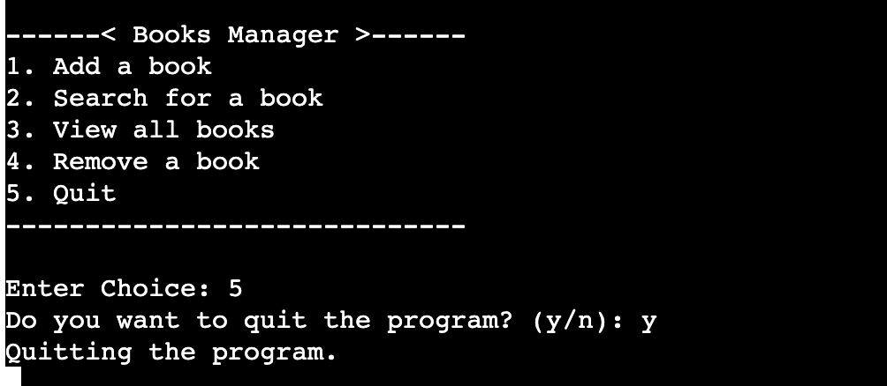

### Introduction

**Project Name**: Books Manager

- Run the program here by clicking this [Live Link](https://books-manager-fe3018dca0f8.herokuapp.com/) 

- View the Google sheet here by clicking this [Link to the Google Sheet](https://docs.google.com/spreadsheets/d/1Df5J3GYvr_W6eTSX4IPEJV5i8eJ19lMWIizdLDeG4p8/edit?usp=sharing)


**Description**:
Books Manager is a Python-based command-line terminal application designed to streamline the management of a digital library through integration with Google Sheets. Users can add, search for, view, and remove books from their library directly from the terminal interface.

### Purpose

**Why it exists**:
The project aims to simplify the process of organizing and maintaining a library of books digitally. It leverages Google Sheets for storage, making it accessible and manageable from anywhere with an internet connection.

### Intended Audience

**Who it's intended for**:
Books Manager is primarily targeted at book enthusiasts, librarians, educators, and anyone who manages a collection of books and prefers a digital solution for organization and accessibility.

### Objectives and Benefits

**Project Objectives**:
Books Manager aims to accomplish the following:

- **Efficient Book Management**: Users can easily add new books, search for existing ones, view their entire library, and remove books as needed, all from a straightforward command-line interface.
- **Integration with Google Sheets**: Utilizes Google Sheets API for backend storage, ensuring data is stored securely and accessible across devices.
- **Streamlined User Experience**: Offers a user-friendly experience with intuitive commands and prompts for seamless interaction.

**Benefits to Target Audience**:

- **Simplicity and Accessibility**: Simplifies the process of managing book collections digitally, reducing the overhead associated with manual cataloging.
- **Centralized Management**: Provides a centralized platform (Google Sheets) for storing and accessing book data, promoting efficiency and organization.
- **Flexibility**: Enables users to manage their library from anywhere, whether at home, in a library, or in an educational institution, enhancing accessibility and convenience.

In summary, Books Manager caters to book enthusiasts, librarians, and educators by offering a straightforward, efficient solution for managing digital libraries. By leveraging Google Sheets integration, accessibility, and ease of use, ultimately benefiting users through streamlined book management capabilities.

## Table of Contents
1. [Introduction](#introduction)
2. [User Stories](#user-stories)
   - [Main Menu Navigation](#main-menu-navigation)
   - [Adding Books](#adding-books)
   - [Removing Books](#removing-books)
   - [Searching for Books](#searching-for-books)
   - [Viewing All Books](#viewing-all-books)
   - [Quitting the Program](#quitting-the-program)
3. [Features](#features)
   - [Adding a Book](#1-adding-a-book)
   - [Searching for a Book](#2-searching-for-a-book)
   - [Viewing All Books](#3-viewing-all-books)
   - [Removing a Book](#4-removing-a-book)
   - [Quitting the Program](#5-quitting-the-program)
4. [Logic Flow](#logic-flow)
5. [Database Design](#database-design)
6. [Technologies](#technologies)
7. [Testing](#testing)
8. [Deployment](#deployment)

### User Stories

#### Main Menu Navigation
- **Story**: As a User, I would like to be able to easily find the various menus so that I can view information or manipulate the library and its books.
- **Reason**: This allows for easy navigation within the application, ensuring that users can quickly access different functionalities without confusion.

#### Adding Books
- **Story**: As a User, I would like to be able to add new books to the library so that I can expand the collection and keep it updated.
- **Reason**: This ensures that users can continuously update their library with new books, keeping the collection current and comprehensive.

#### Removing Books
- **Story**: As a User, I would like to be able to remove books from the library so that I can manage the collection and remove books that are no longer needed.
- **Reason**: This helps users keep their library organized and relevant by removing outdated or unnecessary books.

#### Searching for Books
- **Story**: As a User, I would like to be able to search for books by name so that I can quickly find specific books within my library.
- **Reason**: This provides a quick and efficient way to locate particular books, especially in a large collection.

#### Viewing All Books
- **Story**: As a User, I would like to be able to view a list of all books in the library so that I can get an overview of the entire collection.
- **Reason**: This allows users to see the full scope of their library, making it easier to manage and understand the collection.

#### Quitting the Program
- **Story**: As a User, I want to be able to easily quit the program so that I can exit the application when I am done using it.
- **Reason**: This functionality is essential to provide users with a convenient way to terminate the application, ensuring a smooth and user-friendly experience.

### Features

#### 1. Adding a Book

- **Feature Description**:
  This feature allows users to add a new book to their library through a prompt-based interface.

- **Code Reference**:
  The code responsible for this feature is located in the `create_book_for_library(library)`. Here’s a breakdown of how it works:

  - **User Input**: Prompts the user to input details such as the book's name, author, number of pages, and price.
  - **Input Validation**: Ensures that inputs for pages (integer) and price (float) are valid numeric values.
  - **Book Creation**: Constructs a `Book` object using the provided details.
  - **Library Interaction**: Calls `library.add_book(new_book)` to add the newly created book to the library instance.
  - **Google Sheets Update**: Automatically updates the associated Google Sheet (`update_google_sheet()` method in `Library` class) to reflect the addition of the new book.

- **Value to the User**:
  Users benefit from a straightforward process to input and catalog new books into their digital library, ensuring that their collection remains organized and accessible.

- 
#### 2. Searching for a Book

- **Feature Description**:
  This feature enables users to search for a specific book by its title within the library.

- **Code Reference**:
  The search functionality is implemented in the `search_for_book(library)` function.

  - **User Input**: Prompts the user to enter the name of the book they wish to search for.
  - **Search Logic**: Iterates through the list of books (`self.books` in `Library` class) and compares each book's title (case-insensitive) with the user input.
  - **Output**: Returns details of the book if found (`__str__` method in `Book` class) or a message indicating the book is not in the library.

- **Value to the User**:
  Users can quickly retrieve information about specific books without manually scanning through their entire collection, enhancing efficiency and usability.

- 

#### 3. Viewing All Books

- **Feature Description**:
  This feature displays all books currently stored in the library.

- **Code Reference**:
  Implemented in the `display_books()` method of the `Library` class.

  - **List Display**: Iterates through `self.books` and prints each book's details using their `__str__` method.
  - **Empty Library Handling**: If there are no books (`self.books` is empty), it notifies the user that the library is empty.

- **Value to the User**:
  Provides users with a comprehensive overview of their entire book collection, facilitating easier management and reference.

- 

#### 4. Removing a Book

- **Feature Description**:
  Allows users to remove a book from their library.

- **Code Reference**:
  The removal functionality is handled in the `remove_book(library)` function.

  - **User Input**: Prompts the user to enter the name of the book they want to remove.
  - **Book Removal**: Finds the book by its title (case-insensitive) in `self.books` and removes it.
  - **Google Sheets Update**: Updates the Google Sheet (`update_google_sheet()` method in `Library` class) to reflect the removal of the book.

- **Value to the User**:
  Enables users to maintain an up-to-date library by removing books they no longer wish to keep, ensuring accurate cataloging and management.

- 

#### 5. Quitting the Program

- **Feature Description**:
  Provides an option for users to exit the program.

- **Code Reference**:
  Handled within the `quit_program()` function.

  - **User Confirmation**: Prompts the user to confirm their intention to quit the program (`'y'` for yes, `'n'` for no).
  - **Exit**: Calls `exit()` to terminate the program if the user confirms.

- **Value to the User**:
  Offers a straightforward way to gracefully exit the application once users have completed their tasks, ensuring a user-friendly experience.

- 

### Future Features

- **Advanced Search Filters**:
  - Description: Add advanced search options to filter books by genre, publication date, rating, etc.
  - Value: Improves the search functionality, making it easier for users to find specific books.

- **Book Reviews and Ratings**:
  - Description: Allow users to add reviews and ratings for books in the library.
  - Value: Helps users to make informed decisions about which books to read based on community feedback.

- **User Authentication and Profiles**:
  - Description: Implement user authentication to allow multiple users to have their own book libraries.
  - Value: This would enable users to manage their personal collection of books independently.

### Logic Flow

#### Menu 


#### Add Book


#### Search For Book 


#### View All Books


#### Remove A Book


#### Quit


# Database Design

The database for the Books Manager project leverages Google Sheets as the primary storage mechanism for all book-related data. This approach is chosen for its simplicity, accessibility, and ease of integration with Python. Below is a detailed overview of the database design, including the structure of the Google Sheet and how the data is organized.

## Why Google Sheets?

### Benefits:
- **Ease of Use**: Google Sheets provides an intuitive and user-friendly interface that requires minimal setup.
- **Accessibility**: Data stored in Google Sheets can be accessed from anywhere with an internet connection.
- **Integration**: Google Sheets API allows seamless integration with Python, enabling easy data manipulation and retrieval.
- **Collaboration**: Multiple users can access and update the data simultaneously, making it ideal for collaborative projects.

## Database Structure

**Google Sheet Name**: `books_manager`

**Columns**:
1. **Book Name**: The name of the book.
2. **Author**: The author of the book.
3. **Pages**: The number of pages in the book.
4. **Price**: The price of the book.

Each row in the Google Sheet represents a single book record. The columns store specific attributes of the book, providing a structured format for data storage and retrieval.

## Google Sheet Layout

| Book Name           | Author             | Pages | Price  |
|---------------------|--------------------|-------|--------|
| The Great Gatsby    | F. Scott Fitzgerald| 180   | 10.99  |
| 1984                | George Orwell      | 328   | 8.99   |
| To Kill a Mockingbird | Harper Lee       | 281   | 7.99   |


## Data Types

- **Book Name**: String
- **Author**: String
- **Pages**: Integer
- **Price**: Float

## CRUD Operations

The following CRUD (Create, Read, Update, Delete) operations are supported by the database:

## Technologies
### Python
**Description**: Python is the primary programming language used for the development of the Books Manager project.

**Usage in Project**:
- Core logic for adding, searching, viewing, and removing books.
- Handling user input and interaction.
- Integration with Google Sheets for data storage.

### Google Sheets API
**Description**: Google Sheets API allows the application to interact with Google Sheets, enabling it to read and write data.

**Usage in Project**:
- Storing book details such as name, author, pages, and price.
- Facilitating data retrieval and manipulation operations.

### Heroku
**Description**: Heroku is a cloud platform as a service (PaaS) that enables developers to build, run, and operate applications entirely in the cloud.

**Usage in Project**:
- Deploying and hosting the Books Manager application.
- Managing environment variables and buildpacks.

### GitHub
**Description**: GitHub is a web-based platform used for version control.

**Usage in Project**:
- Source code repository for the Books Manager project.
- Integration with Heroku for continuous deployment.

### Python Libraries

**gspread**:
**Description**: A Python API for Google Sheets.
**Usage in Project**: Facilitates interaction with Google Sheets, including reading, writing, and updating records.

**oauth2client**:
**Description**: A client library for OAuth 2.0.
**Usage in Project**: Handles authentication and authorization for accessing Google APIs.

### Command Line Interface (CLI)
**Description**: The CLI is used to interact with the Books Manager application. It is simple and intuitive, allowing users to input commands to manage their library.

**Usage in Project**:
- Running the application.
- Navigating through different options like adding, searching, viewing, and removing books.

### Testing

#### Test Cases / Manual Testing 

1. Adding a Book

   - **Description**: Test the functionality of adding a new book to the library.
   - **Steps**:
     1. Run the program using `python3 run.py`.
     2. Select option 1. Add a book from the main menu.
     3. Enter the book name when prompted.
     4. Enter the author name when prompted.
     5. Enter the number of pages when prompted.
     6. Enter the price when prompted.
   - **Expected Result**:
     - The book should be added to the library.
     - A message should be displayed: [Book Name] has been added to the library.
     - The book should be in the Google Sheet books_manager.
   - **Actual Result**:
     - The book is added to the library.
     - A message is displayed: [Book Name] has been added to the library.
     - The book is in the Google Sheet books_manager.
     - 
     - 

2. Searching for a Book

   - **Description**: Test the functionality of searching for an existing book in the library.
   - **Steps**:
     1. Run the program using `python3 run.py`.
     2. Select option 2. Search for a book from the main menu.
     3. Enter the name of an existing book when prompted.
   - **Expected Result**:
     - The details of the book should be displayed: Name: [Book Name], Author: [Author], Pages: [Pages], Price: $[Price].
   - **Actual Result**:
    - The details of the book are displayed: Name: [Book Name], Author: [Author], Pages: [Pages], Price: $[Price].
    - 

3. Viewing All Books

   - **Description**: Test the functionality of viewing all books currently in the library.
   - **Steps**:
     1. Run the program using `python3 run.py`.
     2. Select option 3. View all books from the main menu.
   - **Expected Result**:
     - A list of all books currently in the library should be displayed with details: 1. '[Book Name]' by [Author], [Pages] pages, $[Price].
   - **Actual Result**:
     - A list of all books currently in the library are displayed with details: 1. '[Book Name]' by [Author], [Pages] pages, $[Price].
     - 

4. Removing a Book

   - **Description**: Test the functionality of removing an existing book from the library.
   - **Steps**:
     1. Run the program using `python3 run.py`.
     2. Select option 4. Remove a book from the main menu.
     3. Enter the name of an existing book to remove when prompted.
   - **Expected Result**:
     - The book should be removed from the library.
     - A message should be displayed: '[Book Name]' has been removed from the library.
     - The book should no longer be in the Google Sheet books_manager.
   - **Actual Result**:
     - The book is removed from the library.
     - A message is displayed: '[Book Name]' has been removed from the library.
     - The book is no longer in the Google Sheet books_manager.
     - 
     - 

5. Invalid Book Removal

   - **Description**: Test the scenario where an attempt is made to remove a non-existent book from the library.
   - **Steps**:
     1. Run the program using `python3 run.py`.
     2. Select option 4. Remove a book from the main menu.
     3. Enter the name of a non-existent book to remove when prompted.
   - **Expected Result**:
     - A message should be displayed: `The book is not in the library.`
     - No changes should be made to the library or the Google Sheet.
   - **Actual Result**:
     - A message is displayed: `The book is not in the library.`
     - No changes are made to the library or the Google Sheet.
     - 

6. Invalid Book Search

   - **Description**: Test the scenario where an attempt is made to search for a non-existent book in the library.
   - **Steps**:
     1. Run the program using `python3 run.py`.
     2. Select option 2. Search for a book from the main menu.
     3. Enter the name of a non-existent book when prompted.
   - **Expected Result**:
     - A message should be displayed: `The book is not in the library.`
    - **Actual Result**:
     - A message is displayed: `The book is not in the library.`
     - 

7. Exiting the Program

   - **Description**: Test the functionality of exiting the program.
   - **Steps**:
     1. Run the program using `python3 run.py`.
     2. Select option 5. Quit from the main menu.
   - **Expected Result**:
     - The Program should request comfirmation of exit to the user, (y/n) and be (Case Insensitive), it should throw an error if user inputs anything other than (y/Y)/(n/N).
     - The program should exit and the message `Quitting the program.` should be displayed.
   - **Actual Result**:
     - The Program requests comfirmation of exit to the user, (y/n) and is (Case Insensitive), it throws an error if the user inputs anything other than (y/Y)/(n/N).
     - The program exits and the message `Quitting the program.` is displayed.
     - 

8. Invalid Data Type for Pages

   - **Description**: Test the scenario where an invalid data type (non-integer) is entered for the number of pages.
   - **Steps**:
     1. Run the program using `python3 run.py`.
     2. Select option 1. Add a book from the main menu.
     3. Enter the book name when prompted.
     4. Enter the author name when prompted.
     5. Enter a non-integer value (e.g., 'abc') for the number of pages.
     6. Enter the price when prompted.
   - **Expected Result**:
     - The program should display an error message: `Invalid input. Please enter a whole number.`
     - The book should not be added to the library.
   - **Actual Result**:
     - The program displays an error message: `Invalid input. Please enter a whole number.`
     - The book is not added to the library.
     - 

9. Invalid Data Type for Price

   - **Description**: Test the scenario where an invalid data type (non-float) is entered for the book price.
   - **Steps**:
     1. Run the program using `python3 run.py`.
     2. Select option 1. Add a book from the main menu.
     3. Enter the book name when prompted.
     4. Enter the author name when prompted.
     5. Enter the number of pages when prompted.
     6. Enter a non-float value (e.g., 'abc') for the price.
   - **Expected Result**:
     - The program should display an error message: `Invalid input. Please enter a number.`
     - The book should not be added to the library.
   - **Actual Result**:
     - The program displays an error message: `Invalid input. Please enter a number.`
     - The book is not added to the library.
     - 

10. Non-Numeric Input for Pages

    - **Description**: Test the scenario where non-numeric input (e.g., 'one hundred') is entered for the number of pages.
    - **Steps**:
      1. Run the program using `python3 run.py`.
      2. Select option 1. Add a book from the main menu.
      3. Enter the book name when prompted.
      4. Enter the author name when prompted.
      5. Enter a non-numeric value (e.g., 'one hundred') for the number of pages.
      6. Enter the price when prompted.
    - **Expected Result**:
      - The program should display an error message: `Invalid input. Please enter a whole number.`
      - The book should not be added to the library.
   - **Actual Result**:
      - The program displays an error message: `Invalid input. Please enter a whole number.`
      - The book is not added to the library.
     - 

11. Non-Numeric Input for Price

    - **Description**: Test the scenario where non-numeric input (e.g., 'twenty-nine') is entered for the book price.
    - **Steps**:
      1. Run the program using `python3 run.py`.
      2. Select option 1. Add a book from the main menu.
      3. Enter the book name when prompted.
      4. Enter the author name when prompted.
      5. Enter the number of pages when prompted.
      6. Enter a non-numeric value (e.g., 'twenty-nine') for the price.
    - **Expected Result**:
      - The program should display an error message: `Invalid input. Please enter a number.`
      - The book should not be added to the library.
   - **Actual Result**:
      - The program displays an error message: `Invalid input. Please enter a number.`
      - The book is not added to the library.
     - 

12. Invalid Menu Choice

    - **Description**: Test the scenario where an invalid menu choice (non-numeric or out-of-range) is entered in the main menu.
    - **Steps**:
      1. Run the program using `python3 run.py`.
      2. Enter a non-numeric or out-of-range value when prompted to enter a menu choice.
    - **Expected Result**:
      - The program should display an error message: `Invalid choice, please enter a number between 1 and 5.`
      - The main menu should be displayed again for valid input.
    - **Actual Result**:
      - When input is a string, test followed the Expected Result.
      - 
      - When input is an integer outside of the range of the menu (1-5), throws error `Invalid choice, please try again.`
      - 

    - **Fix**:
      - There were two Error cases, one threw the `Invalid choice, please enter a number between 1 and 5.` error if a value that wasnt an integer was given, the other threw `Invalid choice, please try again.`, as an else case in my if/elif statements.
    - **Code Before Fix**:
      - 
    - **Code After Fix**:
      - 
   - **Result**:
      - 
      - 

13. Adding a Book with Empty Name

    - **Description**: Test the scenario where the user attempts to add a book with an empty name.
    - **Steps**:
      1. Run the program using `python3 run.py`.
      2. Select option 1. Add a book from the main menu.
      3. Enter an empty string ("") when prompted for the book name.
      4. Enter the author name when prompted.
      5. Enter the number of pages.
      6. Enter the price.
    - **Expected Result**:
      - The program should display an error message: `Invalid input. Please enter a name.`
      - The book should not be added to the library.
    - **Actual Result**:
      - The program displays an error message: `Invalid input. Please enter a name.`
      - The book is not added to the library.
     - 

14. Viewing All Books When Library is Empty

    - **Description**: Test the scenario where the user views all books in the library when the library is empty.
    - **Steps**:
      1. Run the program using `python3 run.py`.
      2. Select option 3. View all books from the main menu.
    - **Expected Result**:
      - The program should display a message: `The library is empty.`
   - **Actual Result**:
      - The program displays a message: `The library is empty.`
     - 

15. Invalid Data Type for Number of Pages (Negative Integer)

    - **Description**: Test the scenario where a negative integer is entered for the number of pages.
    - **Steps**:
      1. Run the program using `python3 run.py`.
      2. Select option 1. Add a book from the main menu.
      3. Enter a negative integer (e.g., -100) for the number of pages.
      4. Enter the book name, author, and price.
    - **Expected Result**:
      - The program should display an error message: `Invalid input. Please enter a number greater than 0.`
      - The book should not be added to the library.
   - **Actual Result**:
      - The program displays an error message: `Invalid input. Please enter a number greater than 0.`
      - The book is not added to the library.
     - 

16. Invalid Data Type for Price (Negative Float)

    - **Description**: Test the scenario where a negative float value is entered for the book price.
    - **Steps**:
      1. Run the program using `python3 run.py`.
      2. Select option 1. Add a book from the main menu.
      3. Enter a negative float value (e.g., -29.99) for the price.
      4. Enter the book name, author, and number of pages.
    - **Expected Result**:
      - The program should display an error message: `Invalid input. Please enter a number greater than 0.`
      - The book should not be added to the library.
   - **Actual Result**:
     - The program displays an error message: `Invalid input. Please enter a number greater than 0.`
      - The book should not be added to the library.
     - 

17. Removing a Book with Case Sensitivity

    - **Description**: Test the scenario where the user attempts to remove a book with case sensitivity in the name.
    - **Steps**:
      1. Run the program using `python3 run.py`.
      2. Add a book with a specific name (e.g., "Book").
      3. Select option 4. Remove a book from the main menu.
      4. Enter the name of the book using a different case (e.g., "book") when prompted.
    - **Expected Result**:
      - The program should remove the book from the library and display a message: `'[Book Name]' has been removed from the library.`
      - The book should be removed from the Google Sheet.
   - **Actual Result**:
      - The program removes the book from the library and displays a message: `'[Book Name]' has been removed from the library.`
      - The book should be removed from the Google Sheet.
     - 
     - 

18. Viewing All Books After Removal
    - **Description**: Test the scenario where the user views all books after removing all books from the library.
    - **Steps**:
      1. Run the program using `python3 run.py`.
      2. Select option 3. View all books from the main menu.
    - **Expected Result**:
      - The program should display a message: `The library is empty.`
   - **Actual Result**:
     - The program display the message: `The library is empty.`
     - 

### Pep8 Validation 
Python code has been ran through https://pep8ci.herokuapp.com/ validator, and any errors or warnings shown were then fixed. 
[Python Validated](./docs/testing/python-valid.png)

### Bugs and Fixes
- **Issue**: Duplicate Book Entries
- **Description**:
  - Users were able to add multiple books with the same name into the library, causing duplication in the database.
- **Solution**: 
  - Issue left unchanged as it would make sense to allow there to be more than one of the same books in someones collection.

### Deployment

#### Version Control

Site created using Visual Studio Code IDE.
Pushed to a GitHub repository called "books-manager".

- These commands can be used to push code to a repository.
  - `git add <file>`
  - `git commit -m "commit message"`
  - `git push`

#### Deployment to GitHub Pages

- The steps to Deploy to GitHub pages are as follows:
  - Open the Github repo.
  - Navigate to settings.
  - Select 'pages'.
  - Select the main/master branch in the source section.
  - Click save.
  - A live link will be Displayed shortly after.

####s Heroku Deployment 

#### Step 1: Create a New App
1. **Go to the Heroku website.**
2. **Log in to your Heroku account.**
3. **Create a new app:**
   - Click on the "New" button in the top-right corner.
   - Select "Create new app".
   - Enter a unique name for your app.
   - Choose the appropriate region.
   - Click "Create app".

#### Step 2: Configure Variables
1. **Go to the "Settings" tab of your newly created app.**
2. **Configure variables:**
   - Scroll down to the "Config Vars" section.
   - Click "Reveal Config Vars".
   - Add the necessary variables. For example:
     - `PORT` : `8000`
     - `CREDS` : Paste your credentials JSON content here

#### Step 3: Set Up Buildpacks
1. **Still in the "Settings" tab:**
2. **Add buildpacks:**
   - Scroll down to the "Buildpacks" section.
   - Click "Add buildpack".
   - Add the following buildpacks in this order:
     1. Python
     2. NodeJS
   - Click "Save changes".

#### Step 4: Deploy Your App
1. **Navigate to the "Deploy" tab.**
2. **In the "Deployment method" section:**
   - Select "GitHub".
   - If prompted, authorize Heroku to access your GitHub account.
   - Search for the repository.
   - Connect the repository.

#### Step 5: Manual Deployment
1. **In the "Manual deploy" section:**
   - Ensure the "main" branch is selected.
   - Click "Deploy Branch".

#### Step 6: Monitor Deployment
1. **Monitor the progress:**
   - Heroku will begin the deployment process.
   - You can monitor the progress in the "Activity" tab.
   - Once the deployment is complete, you will see a message indicating that your app has been successfully deployed.   

### Clone Locally

* Open IDE of choice and type the following into the terminal:
    * ```git clone https://github.com/NoahDR17/books-manager.git```
* Project will now be cloned locally.

## Credits
[W3Schools](https://www.w3schools.com/python/python_classes.asp) - This site was used to revise my knowledge pn python classes.
[Python.org](https://docs.python.org/3/tutorial/classes.html) - This site was used to learn the rest of what i required to reach my create my project.
[RealPython.com](https://realpython.com/python-enumerate/) - This site was used to learn about the enumerate() function 